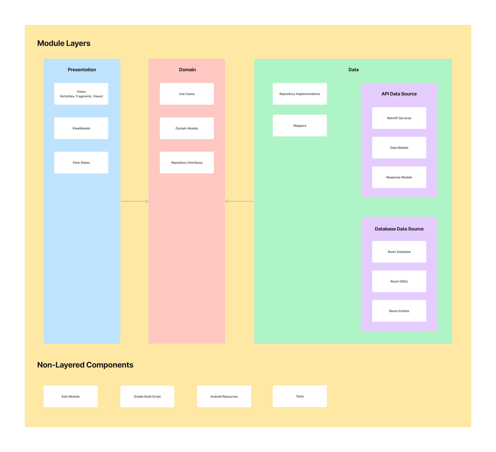

# Project description
[](https://circleci.com/gh/igorwojda/android-showcase)
[](https://codebeat.co/projects/github-com-igorwojda-android-showcase-master)
[](http://kotlinlang.org/)

Showcase is a sample project that presents modern, 2019 approach to
[Android](https://en.wikipedia.org/wiki/Android_(operating_system)) application development using [Kotlin](https://kotlinlang.org/) and latest tech-stack.

The goal of the project is to demonstrate best practices, provide guidance and present flexible application architecture (modular, scalable, maintainable and testable architecture suitable for growing teams and longer
[application lifecycle](https://en.wikipedia.org/wiki/Application_lifecycle_management)).

`Android showcase` will be heavily maintained to match up to date industry standards.

# Project characteristics

This project bring to table set of best practices, tools and solutions:

* 100% [Kotlin](https://kotlinlang.org/)
* Modern architecture (feature modules, Clean Architecture, Model-View-ViewModel)
* [Android Jetpack](https://developer.android.com/jetpack)
* CI pipeline
* Testing
* Static analysis tools
* Dependency Injection
* Material design

# Tech-stack

This project takes advantage of many popular libraries and tools of the Android ecosystem:

* Core
  * Android SDK
  * [Kotlin](https://kotlinlang.org/) + [Coroutines](https://kotlinlang.org/docs/reference/coroutines-overview.html)
* Libraries
  * [Kodein](https://kodein.org/Kodein-DI/)
  * [Retrofit](https://square.github.io/retrofit/)
  * [AndroidX](https://developer.android.com/jetpack/androidx)
  * [Jetpack](https://developer.android.com/jetpack)
  * [Android KTX](https://developer.android.com/kotlin/ktx)
  * [Lottie](http://airbnb.io/lottie)
  * [Stetho](http://facebook.github.io/stetho/)
  * [and more...](https://github.com/igorwojda/android-showcase/blob/master/buildSrc/src/main/kotlin/LibraryDependency.kt)
* Architecture
  * Feature modules
  * Clean Architecture (at module level)
  * Model-View-ViewModel (presentation layer)
  * [Android Architecture components](https://developer.android.com/topic/libraries/architecture)
    * [ViewModel](https://developer.android.com/topic/libraries/architecture/viewmodel)
    * [LiveData](https://developer.android.com/topic/libraries/architecture/livedata)
    * [Navigation](https://developer.android.com/jetpack/androidx/releases/navigation) + Gradle [SafeArgs](https://developer.android.com/guide/navigation/navigation-pass-data#Safe-args) plugin
* Presentation layer
  * [Material Components for Android](https://www.material.io/develop/android/)
  * [Shared element transitions](https://android-developers.googleblog.com/2018/02/continuous-shared-element-transitions.html)
  * [Adaptive Icons](https://developer.android.com/guide/practices/ui_guidelines/icon_design_adaptive)
* Tests
  * [Unit Tests](https://en.wikipedia.org/wiki/Unit_testing) ([JUnit](https://junit.org/junit4/))
  * [Mockito](https://github.com/mockito/mockito) + [Mockito-Kotlin](https://github.com/nhaarman/mockito-kotlin)
  * [Kluent](https://github.com/MarkusAmshove/Kluent)
* Gradle
  * [Gradle Kotlin DSL](https://docs.gradle.org/current/userguide/kotlin_dsl.html)
  * Multi module configuration
  * Dependency autocompletion
  * Custom gradle tasks
  * Additional Gradle plugins
    * [SafeArgs](https://developer.android.com/guide/navigation/navigation-pass-data#Safe-args)
    * [Versions](https://github.com/ben-manes/gradle-versions-plugin)
    * [Ktlint](https://github.com/JLLeitschuh/ktlint-gradle)
    * [Detekt](https://github.com/arturbosch/detekt#with-gradle)

# Architecture

## Module dependencies


## Feature structure
Each feature contains own layers of the clean architecture. This allows for feature to be developed and scaled independently.



# Ci pipeline

[CI config](.circleci/config.yml) allows to execute various jobs in parallel eg. app build will not be stared until all
static checks and tests complete successfully.


# Improvements

 There are many things I personally want to try, play with and add to `android-showcase` project:
* Support for DayNight MaterialTheme
* [Dynamic Feature modules](https://developer.android.com/studio/projects/dynamic-delivery) + Android Dynamic delivery
* Caching layer (memory + disk)
* Add Room
* UI tests (including CI pipeline emulator configuration)
* Data binding
* Custom lint, ktlint and detekt tasks
* Add script to update all dependencies in the project, create PR to run all checks
* Continuous deployment (automatically publish app to Google play store using CI)
* …
* 100+ other things to try, explore and potentially add here (seriously 🤓)

# Contribute
Feedback and new contributions are welcome whether it's through bug reports or new PRs.

# Author

[](https://twitter.com/igorwojda)

[](https://twitter.com/igorwojda)

# License
```
MIT License

Copyright (c) 2019 Igor Wojda

Permission is hereby granted, free of charge, to any person obtaining a copy of this software and associated documentation files (the "Software"), to deal in the Software without restriction, including without limitation the rights to use, copy, modify, merge, publish, distribute, sublicense, and/or sell copies of the Software, and to permit persons to whom the Software is furnished to do so, subject to the following conditions:

The above copyright notice and this permission notice shall be included in all copies or substantial portions of the Software.

THE SOFTWARE IS PROVIDED "AS IS", WITHOUT WARRANTY OF ANY KIND, EXPRESS OR IMPLIED, INCLUDING BUT NOT LIMITED TO THE WARRANTIES OF MERCHANTABILITY, FITNESS FOR A PARTICULAR PURPOSE AND NONINFRINGEMENT. IN NO EVENT SHALL THE AUTHORS OR COPYRIGHT HOLDERS BE LIABLE FOR ANY CLAIM, DAMAGES OR OTHER LIABILITY, WHETHER IN AN ACTION OF CONTRACT, TORT OR OTHERWISE, ARISING FROM, OUT OF OR IN CONNECTION WITH THE SOFTWARE OR THE USE OR OTHER DEALINGS IN THE SOFTWARE.
```

